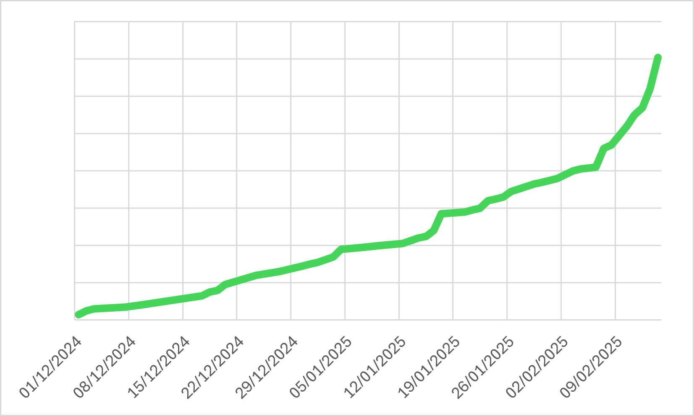
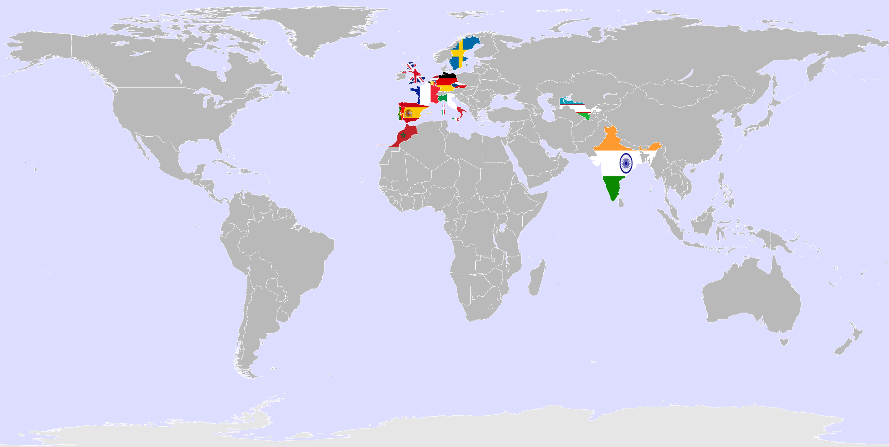
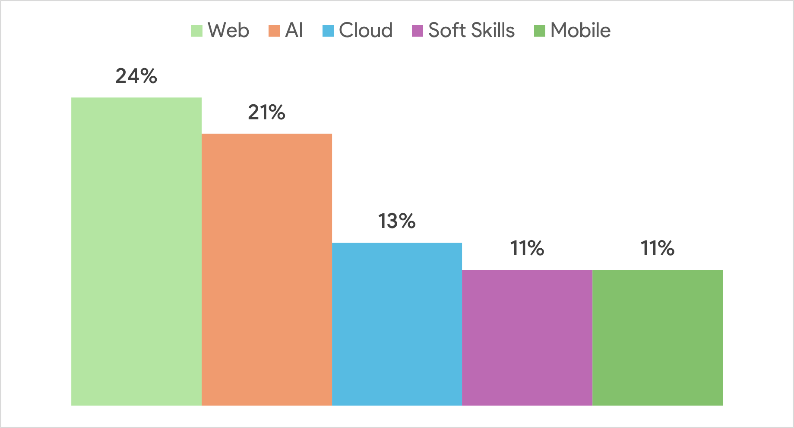

## Call For Paper is closed! ❌

<!-- We're excited to announce that the Call for Papers for the DevFest Pisa 2025 is officially closed! -->

A heartfelt thank you to all the speakers, who dedicated their time to preparing high-quality abstracts for our Call for Papers 💕

Here are some numbers that might be interesting for you from our CFP! 📈

This year we received **141 proposals** with the **last proposal received on February 14 at 10:58 p.m.** 😱

You can see the trend of the CFP submission in this graph:

You can clearly see how the procrastinators waited until the last minute before submitting their proposals. 😂

Most of our proposals come from Italy but we also received submissions from other **12 Countries**!

Talking about the content, the most popular topic is... Web with the 24% of submissions:

The highly diverse yet rich nature of the various topics and speaker backgrounds sets the stage for an unforgettable experience in Pisa!

Stay Tuned!

Any questions? Email us at [pisagdg@gmail.com](mailto:pisagdg+devfest@gmail.com) or reach out on our social channels!

DevFest Pisa Organizer team ❤️
